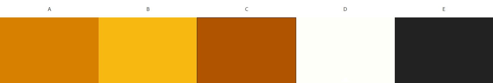
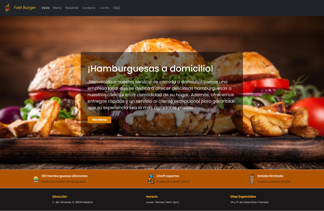
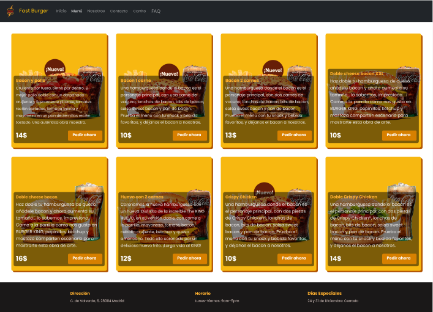
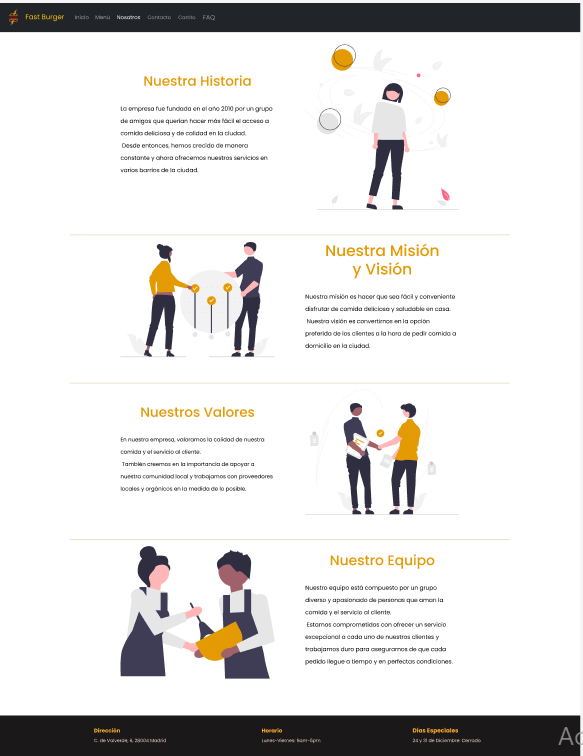
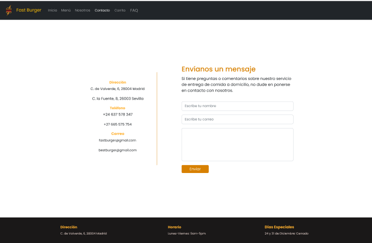
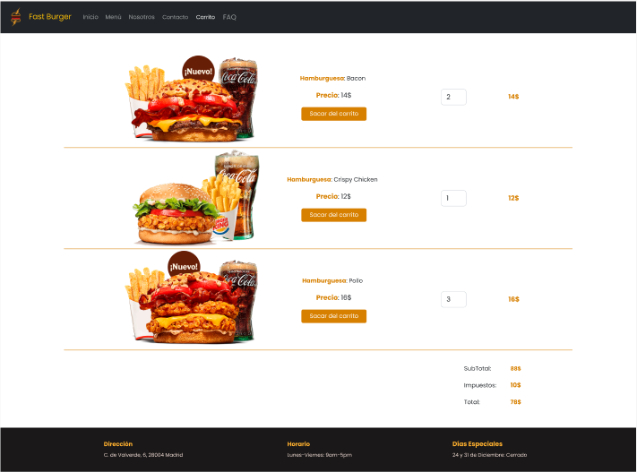
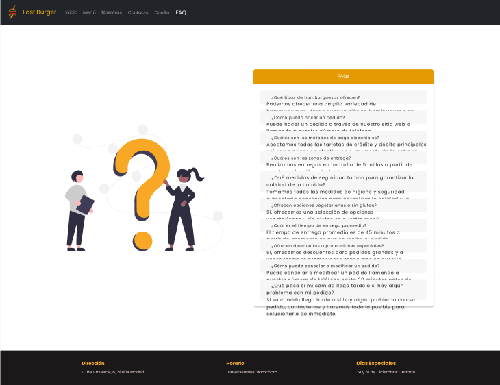

# Diseño De Interfaces Web

## Fast burger

  

   
  

[Agustín Jiménez Polonio](https://github.com/JuanFrancisco21)

16 de Diciembre de 2022  
I.E.S Francisco de los Rios

 

## ÍNDICE

1. Diseño y Prototipado
    - Concepción
    - Paleta de colores
    - Paleta de colores
2. Tecnologías
3. Despliegue
4. Accesibilidad
    - ¿Cómo se han superado los estándares WCAG?
    - Prueba WAVE
    - Problemas encontrados
5. Usabilidad
    - Test y heatmaps
6. Futuras mejoras

 

# Diseño y Prototipado

## Concepción

Todo este proyecto comienza como una actividad para el grado superior DAW. Donde partimos del problema proporcionado por el profesor de crear una Página web basada en el color morado. Con la cual el mismo hizo una sugerencia de hacerla basada en una cofradia. Una vez que teníamos el problema planteado, comenzamos a trabajar en la solución.

Primero, hicimos una investigación sobre el color morado y su simbolismo en la cultura y la historia. Descubrimos que el color morado ha sido asociado con la realeza, la sabiduría y la espiritualidad en muchas culturas a lo largo de la historia. También encontramos que en muchas cofradías, el color morado se utiliza como símbolo de penitencia y humildad.

Con esta información en mente, decidimos enfocar nuestra página web en el simbolismo del color morado en la historia y en la cultura de las cofradías. Creamos un diseño atractivo y fácil de usar que destacaba el color morado y utilizaba imágenes y gráficos para ilustrar el simbolismo del color en diferentes contextos históricos y culturales.

Incluimos secciones en la página que hablaban sobre la historia de la Hermandad de nuestro Municipio, muchas de sus actividad y memorias ademas de cómo se utiliza el color en la actualidad. También agregamos una sección de recursos donde los visitantes podían encontrar enlaces a otros sitios web y recursos relacionados la cofradía.

Una vez planteado nuestro proyecto de la página web sobre la cofradía, desarrollar un prototipo de la página utilizando Adobe xd, un popular marco para desarrollo de prototipos, de código abierto que facilita la creación de sitios web responsivos y adaptables de manera agil.

Finalizando la web con tecnologias como principales tecnologias HTML5, SCSS Y BOOTSTRAP. Todo ello cumpliendo los estandares, tanto de accesibilidad como de usabilidad definidos por WCAG, realizando pruebas con la herramienta WAVE, a la par que comprobaciones con lectura de pantalla para personas con capacidad reducida, o el uso de heatmaps para comprobrar la usabilidad.

## Paleta de colores

El uso del color naranja no será el único. Este será utilizado en conjunto con otros colores
anaranjados que lo complementen y le de una cierta consistencia a nuestro sitio evitando la
monotonía del mismo color. Además se le añadirán a estos el blanco y el negro como colores
neutros otorgando a la página de elegancia en el diseño. La paleta utilizada es la siguiente:

## Prototipo

Una vez pensado el diseño del proyecto utilizamos Adobe Xd para la elaboración del prototipo,
creando diferentes pantallas y elementos para dar forma a nuestro diseño y que este sea
atractivo para el usuario.
También generamos una presentación interactiva para el prototipo nos muestra cómo funciona la
página en la realidad.

### Home

### Menu

### About us

### Contact

### Shooping cart

### FAQ

# Tecnologías

Hemos contado con la magnífica ayuda de una serie de tecnologías que han hecho posible el
desarrollo de nuestra página:

SASS: un preprocesador de CSS que nos ha permitido escribir CSS de manera más eficiente y
con más opciones de personalización. Es un lenguaje de programación que se compila a CSS y
le agrega funcionalidades adicionales como variables, anidaciones y mixins. Esto ha hecho que
sea más fácil mantener y desarrollar los estilos de nuestra página web. Además de todo esto,
SASS nos ofrece una manera especial de comentar nuestros estilos, haciendo posible que se
genere una documentación con estos llamada SassDoc.

Bootstrap: un framework de código abierto que nos ha proporcionado una serie de utilidades
(estilos en forma de clases) y componentes predefinidos como su increíble navbar
completamente responsive para el menú de la página, que pueden ser reutilizados para construir
interfaces de usuario de manera rápida y sencilla. Bootstrap utiliza SASS como su preprocesador
de CSS, con lo que nos ha permitido poder modificar a nuestra elección algunas de sus
utilidades y componentes otorgando a nuestra página una mayor personalidad y distinción.

Gulp: es una herramienta de automatización de tareas que nos ha sido útil para simplificar el
proceso de desarrollo. Ha sido utilizado para realizar las tareas de compilar nuestros estilos en
Sass a css, desarrollar el sassdoc y desplegar nuestro sitio.
Utilizar Gulp en conjunto con SASS y Bootstrap nos ha ayudado a acelerar y simplificar el
proceso de desarrollo de nuestra página web.

# Despliegue

Para el despliegue utilizamos gulp que nos ayuda a automatizar ciertas tareas. Las tareas
automatizadas en este proyecto son las siguientes:

- Compilar Sass
- Generar SassDoc
- Desplegar proyecto en AWS

En el archivo gulpFile del proyecto se puede ver cómo se implementan cada una de estas tareas.

# Accesibilidad

## ¿Cómo se han superado los estándares WCAG?

Para que nuestra página web cumpla con las Pautas de Accesibilidad al Contenido en la Web
(WCAG) se cumplen estos requisitos:

- Se identifica a quién va dirigido el contenido y se asegura de que sea accesible para todos.

- Se utilizan etiquetas de encabezado y estructura de forma adecuada para organizar el
contenido y hacerlo más fácil de entender.

- Se proporciona texto alternativo para las imágenes, para que las personas con discapacidad
visual puedan acceder al contenido.

- Se utilizan colores de alto contraste para mejorar la legibilidad del contenido.

- Etiquetas de título y etiquetas de pie de página para proporcionar información adicional y
hacemos que el contenido sea más fácil de entender.

- Utilizamos formularios y enlaces claros y fáciles de seguir para facilitar la navegación por nuestro
sitio web.

- Nuestro sitio web cumple con todos los tipos de diseño para diferentes dispositivos, siendo
completamente responsive.

## Prueba WAVE

Una vez realizado el análisis de wave no encontramos ningún error, tan solo las siguientes
advertencias:

- Errores pequeños de contraste entre el fondo blanco y el texto amarillo.
- Algunas estructuras de encabezados de la web no empiezan por h1.
- Alguna Imagen con la misma descripción en el atributo alt que otra.

## Problemas encontrados

Problema con el audio del narrador de windows

# Usabilidad

Los principios de usabilidad son principios fundamentales que deben seguir para garantizar que
nuestro producto sea fácil de usar y entender para el usuario. Estos son los principios
perseguidos en este proyecto:

- Simplicidad: La interfaz es lo más sencilla posible, con pocas opciones y poco contenido
para evitar confundir al usuario.
- Coherencia: La interfaz es consistente en su diseño y en cómo funciona, para que el
usuario no tenga que aprender cosas nuevas cada vez que utiliza el producto.
- Responsabilidad: El producto es completamente responsive y se puede usar en toda
serie de pantallas.
- Accesibilidad: El producto es accesible para todos los usuarios debido a su simplicidad y
buena estructura.
- Diseño centrado en el usuario: El producto ha sido diseñado pensando en las
necesidades y preferencias del usuario y de lo que este mismo espera de una web de
comida a domicilio

## Test y heatmaps

Un heatmap es una herramienta de análisis que muestra cómo los usuarios interactúan con una
página web. Se representa mediante un mapa de calor, donde las zonas más cálidas indican las
áreas de la página que han sido más visitadas o interactivas por los usuarios.

Los heatmaps se utilizan comúnmente para entender cómo los usuarios navegan por una página
web y qué elementos llaman más su atención. Esto puede ser útil para optimizar la disposición
de los elementos en la página y hacer que la experiencia de usuario sea más efectiva.

Además, los heatmaps también pueden proporcionar información valiosa sobre cómo los
usuarios utilizan los enlaces o botones de la página, lo que puede ser útil para optimizar la
llamada a la acción y mejorar la tasa de conversión.

En resumen, los heatmaps son una herramienta muy útil para entender cómo los usuarios
interactúan con una página web y para optimizar su diseño y su rendimiento.

Por este motivo hemos realizado 5 test a distintos usuarios para que nos otorgarán esta
información tan valiosa

# Futuras mejoras

1. Mejorar la calidad del diseño utilizando más elementos de bootstrap.
2. Crear más funcionalidades con sass.
3. Retocar y personalizar más bootstrap para dar un toque más personal